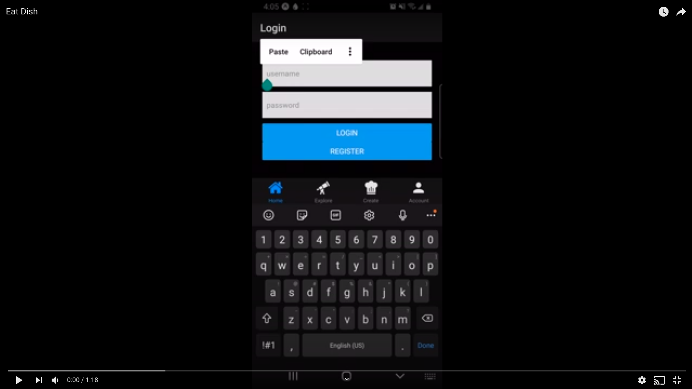

# EatDish
*recipe sharing application*
- react native application spawned from a Hack Reactor hackathon

## demo

<div align="center"><a href="https://www.youtube.com/watch?v=uKTPgYmEAxo" target="_blank"></a></div>

## Installation
with npm:
```sh
$ npm install
```
#### web
in the terminal type `w` for web 
#### mobile
while in the Expo app scan the qr code in your computer terminal

# Minimum Viable Product
- [x] bar and stack navigation
- [x] user input
- [x] user recipes sent to database
- [x] register user
- [x] login user

# Stretch Goals
- [x] search function for looking through recipes
- [x] async local storage so user doesn't have to login again
- [x] screen for personal recipes
- [x] screen for everyone's recipes
- [ ] editing user recipes
- [ ] cleaner UI

Check out the new version of this application here -> 

# Stack
- expo/react-native
- AWS Amplify
  - GraphQL AppSync
  - DynamoDB


# Contributors

[Danny Hanford](https://github.com/dannyhannyford "Danny Hanford")
[Kyle Cordell](https://github.com/kcords "Kyle Cordell")
[Christina Santos](https://github.com/christina003 "Christina Santos")
